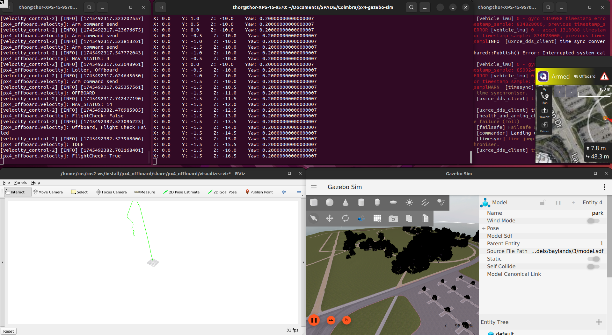
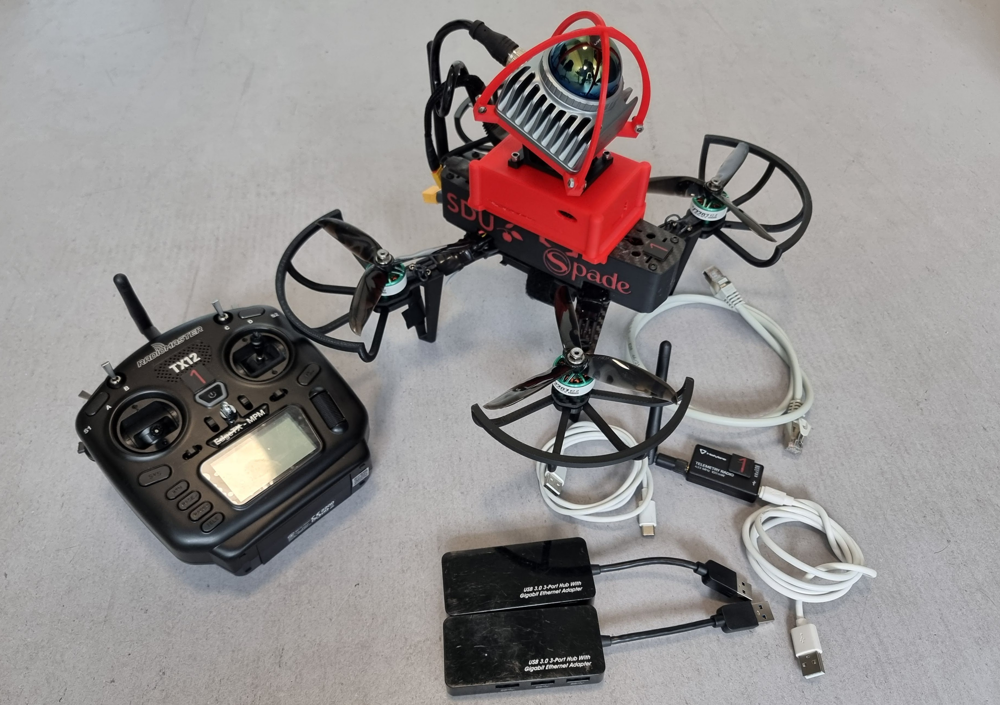
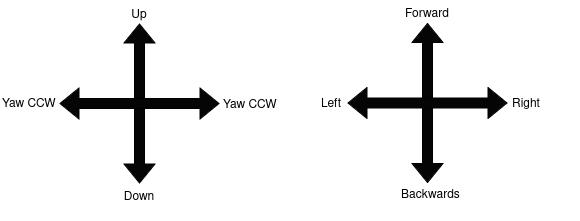

# Coimbra-Shift-APPens-SPADE (Drone Navigation and Mapping In Forrest Like Environments)
Welcome to the Coimbra-Shift-APPens-SPADE repository!

This repository/README will be your starting point and reference for the future in the challenge.

The challenge has several key point for a successful completion, you are a team, solve them together. Some may be working on different part of the solution, but nothing will work if any stone if uncut.

## Pre existing knowledge
This challenges will require a broad spectrum of knowledge, in case you do not know some or most of the topics below, and are not willing to read and learn during Shift Appens. Then this challenge is not for you.

*   Ubuntu, if you run windows you should know VM as well
*   Docker
*   PX4
*   Mobile robotics/Drones
*   Path planning
*   Localization / SLAM
*   ROS 2 - Humble and Jazzy
*   Rviz2
*   Gazebo
*   Programming - Python and C/C++

## The challenge
Your mission is to design an autonomous system that navigates a drone from point A to point B in a
cluttered or non-free space environment—think forests or similarly challenging terrains. The goal is to
achieve fast, collision-free flight while generating a real-time map of the surroundings.

Teams will be selected to fly the real drone based on simulations and evaluation from challenge providers, not all teams are guaranteed to fly the real system. However that does not mean you cant have a blast! 

##### Bonus
Teams that achieve autonomous flight will face an additional challenge to map the entire flight volume with
guaranteed full coverage. The mapping process will include collision-free flight from multiple different points or a smooth trajectory that will cover the entire volume, without the need for landing and takeoff in the middle, only at the endpoints.

**Bring your innovation, coding skills, and teamwork to conquer this challenge, and let your ideas take flight!**

## What you will get
Flying drone out of the box in offboard control will most likely make them crash or damaged, they are expensive equipment, and should be handled accordingly. Only a small selection of spare part have been brought to the Coimbra, a crash may leave the drone in unusable condition. 

## Simulation
The simulation is a crucial part of the development process. It allows you to test your algorithms and code in a safe and controlled environment. A 2D simulation environment from the link [here](https://github.com.mcas.ms/steffanlloyd/px4-gazebo-sim) should be used to start the development of your system. You can chose to set it up in a VM, however it is recommended to run in natively in Ubuntu. 

    

Simulation of 3D lidars can be computationally expensive for your computer but ypu are free to set it up. The real system if equipped with a 3D Livox MID-360 on the top tilted 20 degrees forward, in case you want to match the simulation with the real system.

## Drones
I have brought 2 sets for the selected teams. One team will get one drone allocated. If required the drones will be shared amongst teams later. It is competition between teams, not a sabotage competition, trying so will be penalized. 

        

One set is consistent of the list below:
1. Drone
2. Transmitter
3. 2x ethernet to usb dongle
4. Micro usb cable
5. Usb-c cable
6. Telemetry module
7. Ethernet cable

### Use of the drones
As you hopefully will be working with the real drones in the end there are some rules:
1.  **I do not want to see any injures or damages**
2.  **Keep your fingers away from the propellers - specially when you power it on or retrieve the drone**
3.  **When you get to work with the drones with your group the propellers must me taken of!**
4.  **Loudly tell when the drone is armed and disarmed**
5.  **No person is allowed in the cage when the drone is armed**
6.  **When the drone is airborne one pilot should always have the remote in hand to intervene the flight at any time**
8.  **Charging the batteries should be done in the designated station and in the safety bag**
9.  **If the battery is hot, let it cool before further use, ask me on telegram of you have any doubt**
10. **When working with the drone on the table, only power it with the power supply**
11. **Alwayes monitor the battery of the drone in flight over qgroundcontrol and do not go below 10%** 
12. **Always power of the pi correctly, do not power it on if you do not intend to use it**
                        
                sudo shutdown -h now

"_I am happy to help and answer any of your questions_"

### Explanation of transmitter setup
swE : kill switch Down is killed
swC : Arming switch, Down is armed 
swB : Flight mode selection, {Up; stabilized, Center; Position, Down; Offboard}

Sticks below:

        

To take of in fully "manual" mode make sure to place mode in stabilized, disarm the drone. center the right stick and lower the left stick fully. When you are ready for takeoff, disengage the kill switch and arm the drone, the propellers should spin slowly, increase the throttle until take off. 

### Explanation of setup on pi
At this point you should be familiar with the setup of the drone from the simulation, some things are different in the real drone. The raspberry pi5 5 is flashed with ubuntu 24.04, and have ROS jazzy installed. 

When the drone is powered on it automatically connect to wifi network with credential you can get from me if needed. As the ethernet port is occupied by the lidar you will not be able to connect on that port. Each drone is setup to connect to a local network hosted by your pc with ip 10.42.0.1, when connected with a USB-Eth adapter.

To find the ip of the pi
                        
        nmap 10.42.0.1/24

ssh to \<scanned ip>

        ssh spade_2@<scanned ip>
        Password:spade
You should now have access to the raspberry pi

I recommend you to host a local wifi yourself and connect the drone to that:
        
        nmcli d wifi connect my_wifi password <password>
        nmcli d wifi connect my_wifi password <password> hidden yes #if hidden

Use connect your teams computers to the local wifi and perform the ip scan and connect with ssh.

#### Launch link to flight controller
        source /opt/ros/jazzy/setup.bash
        cd Micro-XRCE-DDS-Agent/
        MicroXRCEAgent serial --dev /dev/ttyUSB0 -b 921600
A long list of messages should occur, if not check the thin usb stick is plugged in. In another terminal on the same network you can check the ros-topics, there should be a bunch of /fmu/in/* and /fmu/out*.  

#### Launch lidar node
        source /opt/ros/jazzy/setup.bash
        cd livox_ws/
        source install/local_setup.bash
        ros2 launch livox_ros_driver2 rviz_MID360_launch.py

Check the rospics /livox/imu and /livox/lidar exist and they are active (use ros2 topic hz \<topic>)

# [Backups, images & rosbags](https://nextcloud.sdu.dk/index.php/s/mjSyKyrLs4mc3FB)
Link above will lead you to the backup up the SD card of the pi, the configuration for the flight controllers and some rosbags, that may become handy for testing some of your algorithms.

The content should be self explanatory, some of the rosbags are ROS 1, and will need to be converted to ROS 2 if you would want to use them. The *_gt has ground truth position measure by MoCap system.

### Reconfiguration of motors
Make shure the motor are asigned to the correct outputs in qgroundcontrol under the actuator tap. The power supply does not supply enough power to spin the motors rapidly. Out may connect the battery to assign the motors, bu be careful. 

## Changes need to drone \#2 after reflash
### raspberry pi5
For drone 2 you will have to change the default ip of the lidar with the following guide:

change ip on line 28 in /home/spade_2/livox_ws/install/livox_ros_driver2/share/livox_ros_driver2/config/MID360_config.json to "192.168.1.132", and build package again ->

        cd livox_ws
        source /opt/ros/jazzy/setup.bash 
        colcon build

Good luck, safe flight and join the telegram channel where i will share information during the challenge if i find it needed... you may miss out.

        

